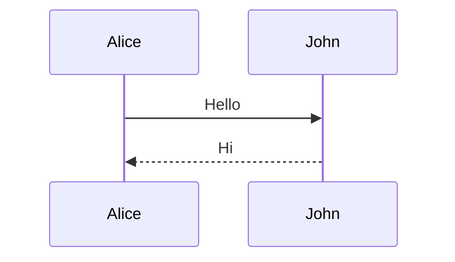
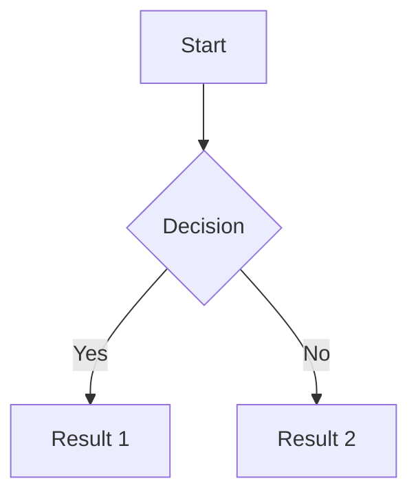
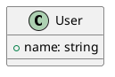

# Key Features Reference

> Sources: 
> - https://sli.dev/guide/animations.md (animations)
> - https://sli.dev/features/*.md (individual features)
> - https://sli.dev/guide/syntax.md (syntax)
> - https://sli.dev/custom.md (configuration)
> Fetched: 2026-04-18

Slidev's specialized features for technical presentations.

For latest feature additions or configuration options, fetch from source URLs above.

## Code Presentation

### Line Highlighting
Highlight specific lines in code blocks.

````markdown
```ts {2,3}           <!-- highlight lines 2 and 3 -->
```ts {2-5}           <!-- highlight lines 2-5 -->
```ts {1|2-3|all}     <!-- progressive: 1, then 2-3, then all -->
```ts {hide|none}     <!-- hide all, then show none highlighted -->
```
````

Syntax: `{line-numbers}` where numbers are:
- `1`, `2`, `3` — specific lines
- `2-5` — ranges
- `|` — separates click stages
- `all` — all lines
- `none` — no highlights
- `hide` — hide code block

### Shiki Magic Move
Granular code transitions between steps.

`````markdown
````md magic-move
```js
console.log('Step 1')
```
```js
console.log('Step 2')
```
```ts
console.log('Step 3' as string)
```
````
`````

Options:
- `lines: true` — show line numbers
- `duration: 500` — animation duration in ms
- Filename in brackets: `magic-move [app.js]`

### Monaco Editor
Turn code blocks into editable editors.

````markdown
```ts {monaco}
console.log('Editable code')
```

```ts {monaco} {height:'auto'}  <!-- auto-growing -->
```

```ts {monaco-diff}  <!-- diff editor -->
console.log('Original')
~~~
console.log('Modified')
```
````

Configure in headmatter:
```yaml
---
monaco: true                    # enable
twoslash: true                  # enable twoslash
monacoTypesSource: local        # or 'cdn', 'none'
lineNumbers: true               # show line numbers
---
```

### TwoSlash
TypeScript type information overlays.

````markdown
```ts twoslash
import { ref } from 'vue'
const count = ref(0)
//            ^?
```
````

Hover over `^?` to see type. Use `^^` for inline types.

### Code Groups
Tabbed code blocks with auto-icons.

````markdown
::code-group

```sh [npm]
npm install
```

```sh [pnpm]
pnpm install
```

```sh [yarn]
yarn add
```

::
````

Enable with `comark: true` in headmatter.

## Diagrams

### Mermaid
Text-based diagrams.

````markdown



````

### PlantUML
More diagram types.

````markdown

````

Configure server in headmatter:
```yaml
---
plantUmlServer: https://www.plantuml.com/plantuml
---
```

## LaTeX Math

Inline: `$E = mc^2$`

Block:
```markdown
$$
\sum_{i=1}^{n} x_i
$$
```

Or use code blocks:
````markdown
```latex
\int_{a}^{b} f(x) dx
```
````

## Animations

### Click Animation Modifiers

```markdown
<div v-click>Default fade in</div>
<div v-click.scale>Scale animation</div>
<div v-click.fade.right>Fade + slide right</div>
<div v-click.none>No animation</div>
```

Built-in presets:
- `fade` — fade from opacity 0.5
- `fade-in` — fade from 0
- `up`, `down`, `left`, `right` — translate 20px
- `scale` — scale to 0.9
- `none` — disable

### Motion (v-motion)

```html
<div
  v-motion
  :initial="{ x: -80, opacity: 0 }"
  :enter="{ x: 0, opacity: 1 }"
  :leave="{ x: 80, opacity: 0 }"
>
  Animated content
</div>
```

Click-triggered motion:
```html
<div
  v-motion
  :initial="{ x: -80 }"
  :enter="{ x: 0 }"
  :click-1="{ y: 30 }"
  :click-2="{ y: 60 }"
  :leave="{ x: 80 }"
>
  Motion with clicks
</div>
```

### Slide Transitions

```yaml
---
transition: slide-left
---
```

Built-in transitions:
- `fade`, `fade-out`
- `slide-left`, `slide-right`, `slide-up`, `slide-down`
- `view-transition` — experimental View Transitions API

Bidirectional:
```yaml
---
transition: go-forward | go-backward
---
```

## Interactive Elements

### Draggable Elements

```markdown
<div v-drag="'element1'" class="absolute">
  Drag me!
</div>
```

Position persists via frontmatter:
```yaml
---
dragPos:
  element1: '100,200,0'  <!-- x, y, rotation -->
---
```

### Drawing & Annotations

Enable in headmatter:
```yaml
---
drawings:
  enabled: true
  persist: false        # save to file
  presenterOnly: false    # only in presenter mode
  syncAll: true          # sync across clients
---
```

Drawing tools available in presentation mode.

### Recording

Enable in headmatter:
```yaml
---
record: dev    # or true, false, 'build'
---
```

Built-in recording with camera view in presenter mode.

## Importing & Modularity

### Import Slides

Split large presentations:

```markdown
---
src: ./pages/intro.md
---

---
src: ./pages/content.md
---
```

### Import Code Snippets

Reference external files:

````markdown
<<< @/snippets/example.ts

<<< @/snippets/example.ts {2,3}  <!-- with highlighting -->

<<< @/snippets/example.ts#snippet-region  <!-- region only -->
````

## Styling

### Scoped CSS

Per-slide styles:

```markdown
<style scoped>
h1 {
  color: red;
}
</style>

# My Slide
```

### Comark Syntax

Component-style classes:

```markdown
# Title {.text-4xl.text-red-500}

Paragraph {.text-sm.opacity-50}
```

Enable: `comark: true` in headmatter.

### UnoCSS Classes

Use Tailwind-like utilities directly:

```markdown
<div class="grid grid-cols-2 gap-4">
  <div class="p-4 bg-blue-500">A</div>
  <div class="p-4 bg-red-500">B</div>
</div>
```

## Export & Distribution

### Export Formats

```bash
slidev export              # PDF (default)
slidev export --format pptx
slidev export --format png
slidev export --format md
```

### Export Options

```bash
slidev export --with-clicks      # Include click steps
slidev export --dark             # Dark mode
slidev export --range 1,5-10     # Specific slides
slidev export --wait 5000        # Wait for rendering
```

### Headmatter Export Config

```yaml
---
export:
  format: pdf
  timeout: 30000
  dark: false
  withClicks: false
  withToc: false
download: true              # Allow PDF download in SPA
---
```

## Special Features

### Block Frontmatter

Use YAML code block for complex frontmatter:

````markdown
```yaml
---
layout: center
title: Complex Configuration
---
```

# Slide Content
````

### Slot Sugar

Named slots in layouts:

```markdown
---
layout: two-cols
---

# Left (default slot)

::left::

# Explicit left

::right::

# Right slot
```

### Global Layers

Components in `global-top.vue` or `global-bottom.vue` appear on all slides.

### Icons

Use any icon from Iconify:

```markdown
<div class="i-carbon-sun"/>          <!-- icon class -->
<div class="text-3xl i-mdi-home"/>  <!-- sized -->
```

Install icon set:
```bash
npm add @iconify-json/mdi
```
