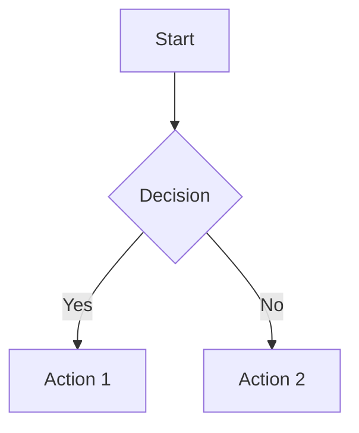

# Slidev Proposal Template

Use this structure when synthesizing slide proposals from parallel agents.

## Presentation Overview

```yaml
Title: [Presentation Title]
Purpose: [tutorial|demo|conference|documentation|pitch]
Target Audience: [developers|stakeholders|general]
Estimated Duration: [X minutes, Y slides]
Theme: [default|seriph|custom]
```

## Slide Structure

| # | Title | Layout | Purpose | Clicks |
|---|-------|--------|---------|--------|
| 1 | [Title] | cover | Hook | 0 |
| 2 | [Agenda] | default | Overview | 0-2 |
| 3 | [Section] | section | Divider | 0 |
| 4 | [Content] | two-cols | Main content | 3-5 |
| ... | ... | ... | ... | ... |
| N | [End] | end | CTA/Questions | 0 |

## Content Outline

### Slide 1: [Title]
**Layout**: [layout-name]
**Key Points**:
- [Point 1]
- [Point 2]

**Notes**:
- [Presenter note 1]
- [Presenter note 2]

---

### Slide 2: [Title]
**Layout**: [layout-name]
**Key Points**:
- [Point 1]

**Animations**:
- Click 1: [Element A appears]
- Click 2: [Element B appears]

---

[Repeat for each slide...]

## Feature Recommendations

### Code Features
- [ ] Monaco Editor — [slides: X, Y]
- [ ] Magic Move — [slides: Z]
- [ ] TwoSlash — [slides: A]
- [ ] Line Highlighting — [slides: B]
- [ ] Code Groups — [slides: C]

### Visual Features
- [ ] Mermaid Diagrams — [slides: D]
- [ ] LaTeX Math — [slides: E]
- [ ] Images — [slides: F]
- [ ] YouTube/Tweet Embed — [slides: G]

### Animation Features
- [ ] v-click sequences — [slides: H]
- [ ] v-clicks for lists — [slides: I]
- [ ] Motion effects — [slides: J]
- [ ] Slide transitions — [global]

### Interactive Features
- [ ] Draggable elements — [slides: K]
- [ ] Drawing/annotations — [global]
- [ ] Recording — [global]

## Animation Plan

### Global Settings
```yaml
---
transition: slide-left
clickAnimation: up
---
```

### Slide-by-Slide Animations

| Slide | Element | Animation | Trigger |
|-------|---------|-----------|---------|
| 1 | Title | fade-in | Page load |
| 2 | Bullet 1 | v-click | Click 1 |
| 2 | Bullet 2 | v-click | Click 2 |
| 3 | Code block | line highlight | Click 1-3 |
| ... | ... | ... | ... |

## Configuration

### Headmatter

```yaml
---
theme: default
# or: seriph, or ./my-theme

title: [Presentation Title]
info: |
  ## [Subtitle/Description]
  
  [Author Name]
  
  [Date/Event]

# Fonts
fonts:
  sans: Roboto
  serif: Roboto Slab
  mono: Fira Code

# Features
lineNumbers: true
monaco: true
twoslash: true
comark: true

# Styling
aspectRatio: 16/9
canvasWidth: 980
colorSchema: auto

# Export
export:
  format: pdf
  withClicks: false
  dark: false

download: true

# Drawing
drawings:
  enabled: true
  persist: false
  presenterOnly: false
  syncAll: true

# Recording
record: dev

# SEO
seoMeta:
  ogTitle: [Title]
  ogDescription: [Description]
  ogImage: [Image URL]
---
```

### Per-Slide Frontmatter Examples

```yaml
---
layout: two-cols
clicks: 5
transition: fade
---
```

```yaml
---
layout: center
preload: true
routeAlias: intro
---
```

```yaml
---
layout: image-right
image: /screenshot.png
class: text-white
zoom: 1.2
---
```

## Directory Structure

```
my-slides/
├── slides.md              # Main entry
├── package.json           # Dependencies
├── components/            # Custom Vue components
│   └── MyComponent.vue
├── layouts/               # Custom layouts
│   └── CustomLayout.vue
├── pages/                 # Split slides
│   ├── intro.md
│   └── content.md
├── public/                # Static assets
│   ├── images/
│   └── videos/
├── styles/                # Custom CSS
│   └── custom.css
└── snippets/              # Code snippets for import
    └── example.ts
```

## Implementation Checklist

### Setup
- [ ] Create project: `npm init slidev`
- [ ] Install theme: `npm add @slidev/theme-[name]`
- [ ] Install addons: `npm add @slidev/[addon]`
- [ ] Configure headmatter
- [ ] Add custom fonts if needed

### Content
- [ ] Write all slide content
- [ ] Add presenter notes
- [ ] Import external code snippets
- [ ] Add images to `public/`

### Code
- [ ] Configure Monaco if needed
- [ ] Add TwoSlash annotations
- [ ] Set up Magic Move sequences
- [ ] Test line highlighting

### Visual
- [ ] Apply appropriate layouts
- [ ] Configure animations
- [ ] Add transitions
- [ ] Test dark/light modes

### Polish
- [ ] Test all click sequences
- [ ] Verify component rendering
- [ ] Check responsive scaling
- [ ] Export and review PDF

## Notes for Implementation

### Best Practices
- Start simple, add features progressively
- Use `v-clicks` for bullet points, `v-click` for individual elements
- Keep click counts reasonable (3-5 per slide max)
- Use `two-cols` for code + explanation
- Use `section` layout for major transitions
- Add presenter notes for complex slides

### Common Patterns

**Code Demo Slide**:
```yaml
---
layout: two-cols
---

# How It Works

Left: Explanation

::right::

```ts {monaco}
// Editable example
```

<!--
Walk through each line slowly.
Let audience try modifications.
-->
```

**Comparison Slide**:
```yaml
---
layout: two-cols-header
---

Comparing Approaches

::left::

**Before**
- Point 1
- Point 2

::right::

**After**
- Point 1
- Point 2
```

**Diagram Explanation**:
```yaml
---
layout: center
---



<v-click>

Key insight here

</v-click>
```

## Approval Sign-off

Before proceeding to implementation:

- [ ] Structure approved
- [ ] Content complete
- [ ] Features confirmed
- [ ] Timeline acceptable
- [ ] Export needs met

**Next Step**: [Generate slides.md / Revise proposal / Add content]
