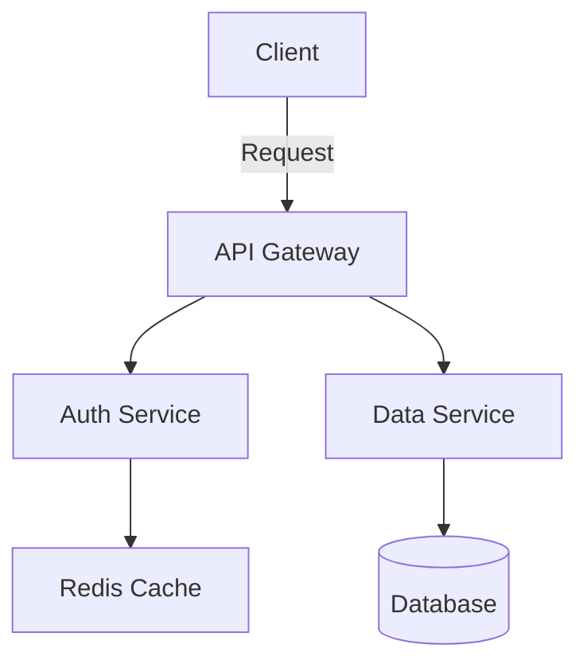

# Slidev Slide Templates

Common slide patterns and their implementations.

## 1. Title/Cover Slide

```markdown
---
layout: cover
background: /cover-image.png  # optional
class: text-white             # if dark background
---

# My Awesome Presentation

Subtitle or tagline here

By [Author Name] | [Date/Event]
```

## 2. Introduction Slide

```markdown
---
layout: intro
---

# What We'll Cover Today

<v-clicks>

- Key concept 1
- Key concept 2
- Live demonstration
- Q&A

</v-clicks>
```

## 3. Section Divider

```markdown
---
layout: section
---

# Part 1: Getting Started
```

## 4. Content with Bullets

```markdown
---
layout: default
---

# Key Features

<v-clicks depth="2">

- Feature A
  - Sub-point 1
  - Sub-point 2
- Feature B
  - Sub-point 1
- Feature C

</v-clicks>
```

## 5. Code Explanation (Two Columns)

```markdown
---
layout: two-cols
---

# Code Example

The `useState` hook manages component state.

Key points:
- Returns tuple
- Triggers re-render
- Can be any type

::right::

```tsx {monaco} {height:'auto'}
function Counter() {
  const [count, setCount] = useState(0)
  
  return (
    <button onClick={() => setCount(c => c + 1)}>
      Count: {count}
    </button>
  )
}
```
```

## 6. Progressive Code Reveal

```markdown
---
layout: center
clicks: 4
---

# Step by Step

```ts {1|2-4|5-7|all}
function createStore() {
  // 1. Initialize state
  let state = {}
  
  // 2. Create getter
  const getState = () => state
  
  // 3. Create setter
  const setState = (newState) => {
    state = { ...state, ...newState }
  }
  
  // 4. Return API
  return { getState, setState }
}
```

<!--
Click through each section:
1. Setup
2. Getter logic
3. Setter with spread
4. Public API
-->
```

## 7. Magic Move Code Demo

`````markdown
---
layout: center
---

# Refactoring Example

````md magic-move
```js
function greet(name) {
  console.log('Hello, ' + name)
}
```

```js
function greet(name) {
  const message = 'Hello, ' + name
  console.log(message)
}
```

```js
function greet(name) {
  const message = `Hello, ${name}`
  console.log(message)
}
```
````
`````

## 8. Mermaid Diagram

```markdown
---
layout: center
---

# Architecture



<v-click>

**Flow**: Client → Gateway → Services → Storage

</v-click>
```

## 9. Comparison Slide

```markdown
---
layout: two-cols-header
---

Before vs After

::left::

## Traditional

<v-clicks>

- Manual configuration
- Complex setup
- Steep learning curve

</v-clicks>

::right::

## Modern Approach

<v-clicks>

- Zero-config defaults
- Simple installation
- Gentle learning curve

</v-clicks>
```

## 10. Image Showcase

```markdown
---
layout: image-right
image: /screenshot.png
---

# New Dashboard

<v-clicks>

- Real-time updates
- Dark mode support
- Customizable widgets
- Export to PDF

</v-clicks>
```

## 11. Full Screen Demo

```markdown
---
layout: iframe
url: https://demo.example.com
---
```

Or with context:

```markdown
---
layout: iframe-right
url: https://example.com
class: p-4
---

# Live Demo

Check out the interactive features:

<v-clicks>

- Try the search
- Toggle settings
- Share functionality

</v-clicks>
```

## 12. Quote/Testimonial

```markdown
---
layout: quote
---

> "This tool completely transformed how we build presentations. The developer experience is unmatched."

— Sarah Chen, Tech Lead at Company
```

## 13. Statement/Fact

```markdown
---
layout: fact
---

# 50%

Reduction in presentation creation time
```

## 14. Statement Slide

```markdown
---
layout: statement
---

# "Good code is its own best documentation."
```

## 15. Centered Single Concept

```markdown
---
layout: center
---

<div v-motion
  :initial="{ scale: 0.8, opacity: 0 }"
  :enter="{ scale: 1, opacity: 1 }"
  :click-1="{ scale: 1.1 }"
>

# The Big Idea

Simplify complex workflows

</div>
```

## 16. TOC / Overview

```markdown
---
layout: default
---

# Agenda

<Toc :columns="2" :maxDepth="1"/>
```

## 17. Interactive Component

```markdown
---
layout: center
---

# Try It

<Transform :scale="1.2">
  <MyInteractiveDemo />
</Transform>

<v-click>

Move the sliders to see real-time updates

</v-click>
```

## 18. Code with TwoSlash

```markdown
---
layout: center
---

# TypeScript Types

```ts twoslash
interface User {
  id: number
  name: string
  role: 'admin' | 'user'
}

const user: User = {
  id: 1,
  name: 'Alice',
  role: 'admin'
}
//    ^?
```
```

## 19. Code Group (Multiple Languages)

```markdown
---
layout: center
---

# Installation

::code-group

```bash [npm]
npm install my-package
```

```bash [pnpm]
pnpm add my-package
```

```bash [yarn]
yarn add my-package
```

::
```

## 20. Final/Thank You Slide

```markdown
---
layout: end
class: text-center
---

# Thank You!

## Questions?

<Link to="1">Back to start</Link>

<!--
Thank the audience
Open for questions
Share contact info
-->
```

## 21. Hidden Detail Slide

```markdown
---
layout: default
clicks: 3
---

# Implementation Details

<div v-click>

## Overview

High level concept

</div>

<div v-click>

## The Problem

What we're solving

</div>

<div v-click>

## The Solution

How we solve it

</div>
```

## 22. Draggable Annotation

```markdown
---
layout: image-left
image: /diagram.png
---

# Key Components

<Arrow x1="350" y1="200" x2="450" y2="250" color="red" width="3"/>

<VDragArrow v-drag="'arrow1'" x1="100" y1="100" x2="200" y2="150"/>

<v-click>

Drag the arrow to point at key areas

</v-click>
```

## 23. YouTube Video

```markdown
---
layout: center
---

# Video Demo

<Youtube id="dQw4w9WgXcQ" :width="800" :height="450"/>

<v-click>

Watch for the key technique at 2:30

</v-click>
```

## 24. LaTeX Math

```markdown
---
layout: center
---

# The Formula

$$
e^{i\pi} + 1 = 0
$$

<v-click>

Euler's identity connects five fundamental constants

</v-click>
```

## 25. Custom Styled Slide

```markdown
---
layout: none
class: my-custom-slide
---

<style scoped>
.my-custom-slide {
  background: linear-gradient(135deg, #667eea 0%, #764ba2 100%);
  color: white;
}
h1 {
  font-size: 4rem;
  text-shadow: 2px 2px 4px rgba(0,0,0,0.3);
}
</style>

# Fully Custom

Create any design you need
```

## 26. Light/Dark Variant

```markdown
---
layout: center
---

<LightOrDark>
  <template #light>
    


  </template>
  <template #dark>
    


  </template>
</LightOrDark>
```

## 27. Table of Contents with Context

```markdown
---
layout: default
---

# Where We Are

<Toc mode="onlyCurrentTree" :maxDepth="2"/>

We're currently in **Section 2: Implementation**
```

## 28. Speaker Note Demo

```markdown
---
layout: default
---

# Demo Time

Let's see it in action!

<!--
Before switching to demo:
- Remind about the specific features
- Ask audience what they want to see first
- Have backup plan if live demo fails
- Check screen sharing is working
-->
```

## 29. Transition Showcase

```markdown
---
layout: center
transition: fade
---

# Fade Transition

This slide fades in

---

# Next Slide

Default transition

---
layout: center
transition: slide-up
---

# Slide Up

This one slides from bottom
```

## 30. Export-Specific Content

```markdown
---
layout: default
---

# Summary

Key takeaways:

<v-clicks>

- Point 1
- Point 2
- Point 3

</v-clicks>

<RenderWhen context="print">

**Additional notes for printed version:**
More detailed explanation here

</RenderWhen>
```

## Quick Reference: Common Props

### Frontmatter per Slide

```yaml
---
layout: two-cols
clicks: 5
transition: fade
preload: true
routeAlias: section-1
zoom: 1.1
class: custom-class
hideInToc: false
dragPos:
  element1: '100,200,0'
---
```

### Animation Attributes

```markdown
<div v-click>Click 1</div>
<div v-click="3">Click 3</div>
<div v-click="'+2'">2 after previous</div>
<div v-click.hide>Hide after next</div>
<div v-after>With previous</div>

<v-clicks every="2">Show 2 per click</v-clicks>
```

### Code Block Options

````markdown
```ts {monaco}              <!-- editable -->
```ts {monaco-diff}         <!-- diff editor -->
```ts {monaco} {height:'auto'}  <!-- auto-height -->
```ts twoslash              <!-- TypeScript types -->
```ts {1|2-3|all}           <!-- line highlighting -->
```ts {1,3}{at:3}           <!-- lines + at click 3 -->
```mermaid {scale:0.8}      <!-- diagram scaled -->
```
````
